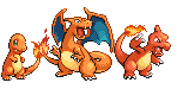

export { default as theme } from './theme'
import { Appear } from 'mdx-deck'
import {IframeVotes} from './components/IframeVotes'
import {ProposalTitle} from './components/ProposalTitle'

# The next Javascript 🚀

import {Author} from './components/Author.js'

<Author />
---
### Javascript is evolving


---
**ES6**, I choose you!<br />


---
import {FeaturesES2015} from './components/FeaturesES2015.js'

<FeaturesES2015 />

And much more...
---

## ~~ES6~~ EcmaScript 2015
### 🤩 * Tons of additions!*
<br />
---
<br/>

## EcmaScript 2016
### 😅 Array#includes and exponential operator
<br />

---
<br/>

# EcmaScript 2017
### 😱 async/await
### 😬 Object.values/Object.entries
### 🎸 Trailing commas in function parameter list and calls
### and more! 🙌

---
# so... what's next? 🤔🐲

---
# EcmaScript 2018
<br/>

### Oh, yes. 😎🔥

---
#### But before continuing... 🙋‍♂️
# TC39 Process & Stages
###### More info: https://tc39.github.io/process-document/
---
# Who is TC39?
The committe responsible for evolving Javascript.<br />
Its members are companies (major browser vendors) and others.
Operates by consensus.
---
# I have a picture of them! 📸
---
# TC39 in action!
<br />
---
# Real TC39 in real action!

---
# But, how the TC39 works?
Meetings every two months 📆<br />
Proposals go through a process based on stages 🚵‍♂️

---
# 💡 Stage 0: Strawman
Just an idea, not a formal proposal. You could even write one!<br />
Very highly likely it will change or be dropped.
---
# 🤔 Stage 1: Proposal
TC39 is willing to examine, discuss and contribute to the proposal. <br />
WIP, much could change or even dropped.
---
# 📝 Stage 2: Draft
Firt version of what will be in the specification.<br />
Changes could occur.
---
# 👩🏽‍💼 Stage 3: Candidate
Spec is completed but needs feedback from browser implementations and users.<br />
Changes are unlikely but could happen.
---
# 🤩 Stage 4: Finished
It will be included to the next yearly standard ratification.
---
# Lots of proposals on different stages
#### https://github.com/tc39/proposals
---
# Vote your proposals! 🗳
## http://TODO

---
<ProposalTitle title='global' stage={3} />

```javascript
// If we're in a browser, the global namespace is named 'window'. If we're
// in node, it's named 'global'. If we're in a shell, 'this' might work.
const globalThis = (typeof window !== "undefined"
  ? window
  : (typeof process === 'object' &&
      typeof require === 'function' &&
      typeof global === 'object')
    ? global
    : this);
```
<IframeVotes proposal='global' />
---
<ProposalTitle title='array-last' stage={1} />

```javascript
myArray[myArray.length - 1] // return the last item of the array
// but it has some problems...
const thoughLastIndex = myArray.length - 1
myArray[myArray.length] // manual error
myArray[thoughLastIndex - 1] // manual error

// using the new proposal
myArray.lastItem // return the last item of the array

```
<IframeVotes proposal='array-last' />

---
<ProposalTitle title='optional-chaining' stage={1} />

```javascript
var street = user.address && user.address.street;
var fooInput = myForm.querySelector('input[name=foo]')
var fooValue = fooInput ? fooInput.value : undefined
// using optional chainig
var street = user.address?.street
var fooValue = myForm.querySelector('input[name=foo]')?.value

```
<IframeVotes proposal='optional-chaining' />

---
<ProposalTitle title='pipeline-operator' stage={1} />

```javascript
const doubleSay = str => str + ", " + str
const capitalize = str => str[0].toUpperCase() + str.substring(1)
const exclaim = str => str + '!'
// old way
let result = exclaim(capitalize(doubleSay("hello")));

// using the new proposal
let result = "hello"
  |> doubleSay
  |> capitalize
  |> exclaim

console.log(result) // "Hello, hello!"
```
<IframeVotes proposal='pipeline-operator' />